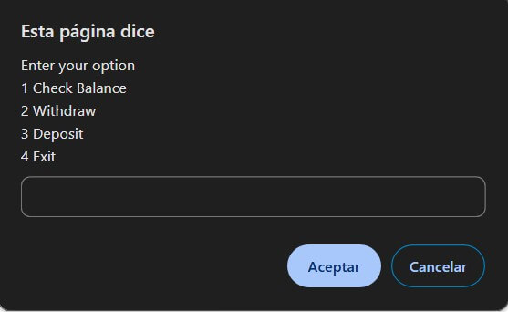
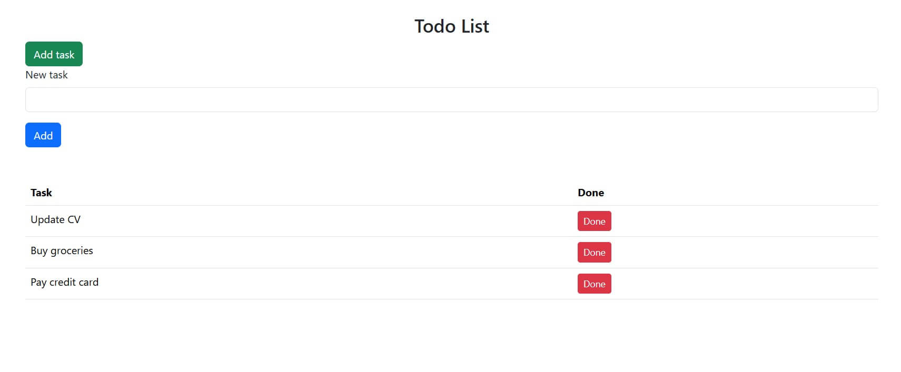
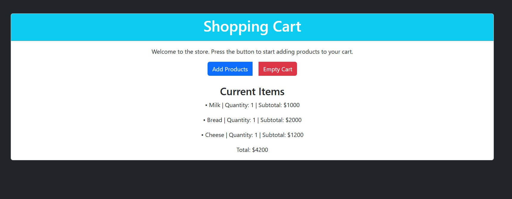
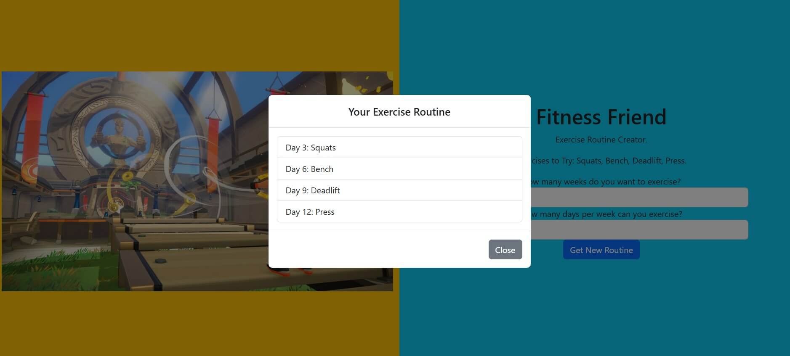
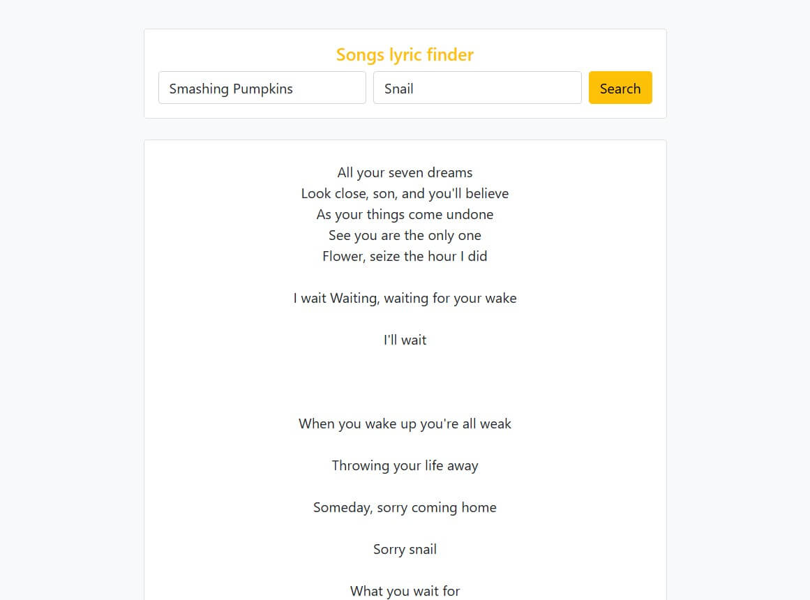
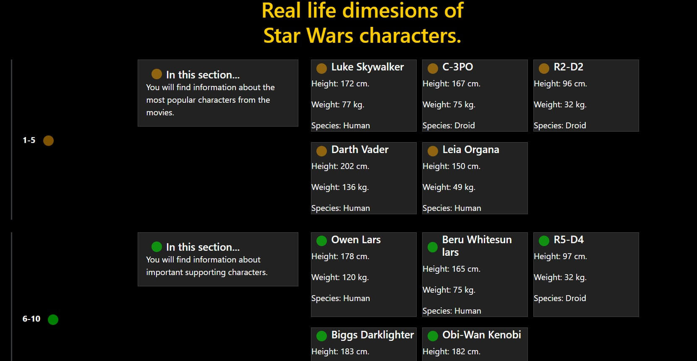

# fullstack-js-trainee-bootcamp
Projects and tasks from the Fullstack JS Trainee Bootcamp, featuring frontend and JavaScript modules with hands-on practice in basic and intermediate concepts, including APIs and dynamic interfaces.

## Frontend Section
### Mini-Projects:

### Simple bank simulator - [Live View](https://nostrand.github.io/fullstack-js-trainee-bootcamp/bank-simulator/src/index.html)
A basic online banking simulator designed to practice core JavaScript concepts. The application features a simple, alerts based interface that allows users to log in, check their balance, make withdrawals, and deposit funds.

To test the Simple Bank Simulator, use the following credentials:

| User ID | Password   |
|---------|------------|
| 1       | 117        |
| 2       | nostromo   |
| 3       | niffler    |

  

### Todo app - [Live View](https://nostrand.github.io/fullstack-js-trainee-bootcamp/todo-app/index.html)
This simple to-do list app allows users to manage tasks. Users can add tasks through a form, view the task list, and mark tasks as "Done" to remove them. The initial task list is preloaded with sample items. It's only for testing, it doesn't include local storage.

  

### Shopping cart - [Live View](https://nostrand.github.io/fullstack-js-trainee-bootcamp/shopping-cart/index.html)
An interactive shopping cart mini-project that combines frontend and JavaScript interactions. Users can add products, view their cart with alerts and on-screen updates, and empty the cart—all with button clicks and dynamic prompts.

  

### Exercise routine creator - [Live View](https://nostrand.github.io/fullstack-js-trainee-bootcamp/exercise-routine-creator/src/index.html)
A simple exercise routine generator using JavaScript and Bootstrap to create customizable weekly workout plans.

  

### Song lyrics finder - [Live View](https://nostrand.github.io/fullstack-js-trainee-bootcamp/song-lyrics-finder/src/index.html)
This is a simple web app that allows users to search for song lyrics by entering the artist’s name and song title. Using the Lyrics.ovh API, it fetches the lyrics and displays them in a clean and user-friendly interface.

  

### Star Wars characters API - [Live View](https://nostrand.github.io/fullstack-js-trainee-bootcamp/star-wars-characters-api/src/index.html)
A character viewing app using the Star Wars API (SWAPI) to display information about characters in the Star Wars universe. On hover, it displays 5 characters per category, featuring real life dimension stats like height, weight and species. Designed to practice API calls and dynamic rendering with JavaScript.

  

